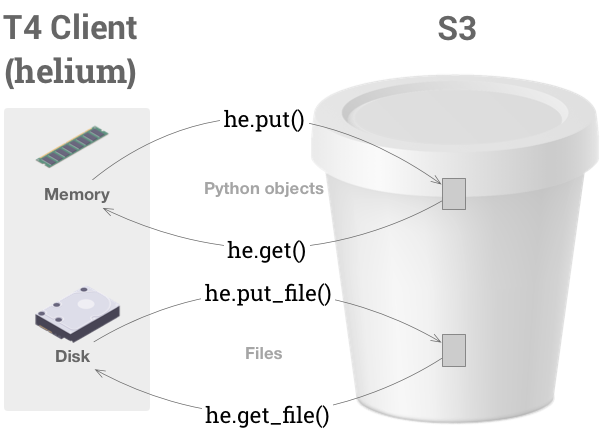

# Alpha - technology preview

T4 is alpha software. It is not yet recommended for production use.

## T4 is like Dropbox for data science, built on S3

* T4 adds search, content preview, versioning, and a Python API to any S3 bucket
* Every file in T4 is versioned and searchable
* T4 is for data scientists, data engineers, and data-driven teams

## Known limitations of the Alpha Preview

* Web catalog supports only one bucket (temporary limitation)

## Components

* Catalog (JavaScript) - Search, browse, and preview your data in S3
* Ocean (Python) - Read, write, and annotate Python objects in S3

## Documentation
* [User docs](./UserDocs.md)
* [Developer docs](./DeveloperDocs.md)

## Things you can do with T4

* Find the data that you're looking for
    * Preview Jupyter notebooks, images, and markdown files in S3
    * Browse any S3 bucket
    * Search every file in your bucket
    * Annotate files and directories with searchable JSON tags

* Back everything up
    * Store files too large for git or git LFS
    * Copy local directories to the cloud
    * Save Jupyter notebooks, with all of their dependencies, in S3

* Reproduce all the things
    * Build pipelines from _immutable snapshots_, producing consistent results across machines, time, and collaborators
    * Travel time to recover any version of any file

* Collaborate
    * Securely share large data
    * Know the history of every change to every file
    * Diff data snapshots to see what's changed

* Summarize data
    * [ ] Slice files with SQL queries, without ever spinning up a database
    * [ ] Visualize data with Vega

