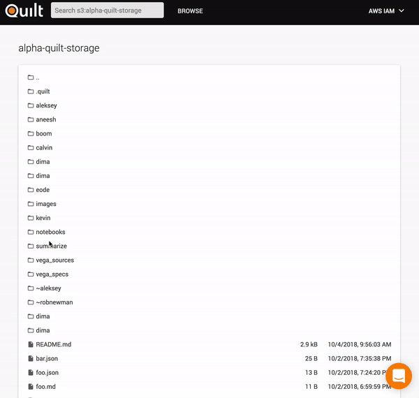

# Alpha - technology preview

T4 is alpha software. It is not yet recommended for production use.

## Overview
[Rethinking S3: Announcing T4, a team data hub](https://blog.quiltdata.com/rethinking-s3-announcing-t4-a-team-data-hub-8e63ce7ec988).

## A team data hub for S3

* T4 adds search, content preview, versioning, and a Python API to any S3 bucket
* Every file in T4 is versioned and searchable
* T4 is for data scientists, data engineers, and data-driven teams

### Use cases
* Collaborate - get everyone on the same page by pointing them all to the same immutable data version
* Experiment faster - blob storage is schemaless and scalable, so iterations are quick
* Recover, rollback, and reproduce with immutable packages
* Understand what's in S3 - plaintext and faceted search over S3

### Key features
* Browse, search any S3 bucket
* Preview images, Jupyter notebooks, [Vega visualizations](https://vega.github.io/) - without downloading
* Read/write Python objects to and from S3
* Immutable versions for objects, immutable packages for collections of objects

## Known limitations of the Alpha Preview

* Web catalog supports only one bucket (temporary limitation)

## Components

* `/catalog` (JavaScript) - Search, browse, and preview your data in S3
* `/api/python` - Read, write, and annotate Python objects in S3

## Documentation
* [User docs](./UserDocs.md)
* [Developer docs](./DeveloperDocs.md)

