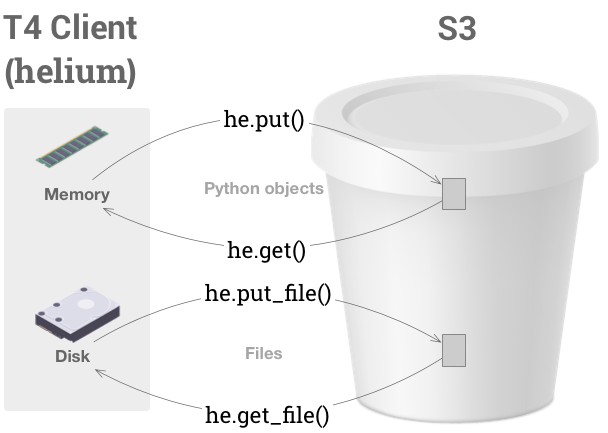

This file documents the T4 Python API, `helium`. `helium` allows you to interact with your T4 instance in Python.

## Installation

Ensure that you have Python 3.6, and the [AWS CLI](https://aws.amazon.com/cli/) (`pip install aws-cli`).

If this is your first time using AWS, run the following to store the IAM credentials you wish to use with T4:
```
$ aws configure
```

You may wish create a Quilt-specific [profile](https://docs.aws.amazon.com/cli/latest/userguide/cli-multiple-profiles.html).

Install T4: 

```
$ pip install git+https://github.com/quiltdata/t4.git#subdirectory=ocean
```

## API reference

> T4 expects S3 paths of the form `BUCKET_NAME/path/to/dir/data.csv`.

### Reading and writing data




#### `helium.get(src [, snapshot=None | version=None])`
Retrieves `src` object from T4 and loads it into memory. Returns a `(data, metadata)` tuple.

Does not work on all objects. For a list of supported objects, see [Serialization](#serialization).

Pass a snapshot hash to the optional `snapshot` parameter to retrieve the state of an S3 object at a given snapshot. Pass a version hash to the optional `version` parameter to retrieve the state of an S3 object at a given version. Only one or none of these two parameters may be specified at a time.

#### `helium.put(src, dest, meta={})`
Writes the in-memory object `src` to the path `dest` in S3.
Transparently serializes some object types.
See [Serialization](#serialization) for details.

You can annotate your object with custom metadata by passing a `dict`
to `meta=`. Object metadata are indexed and searchable by the helium API.

For more on metadata, see [Metadata and search](#metadata-and-search).

#### `helium.get_file(src, dest [, snapshot=None | version=None])`
Retrieves `src` object from T4, and writes to the `dest` file on your local disk.

`snapshot=` and `version=` optional parameters, described in `helium.get()`.

#### `helium.put_file(src, dest, meta={})`
Writes the local file `src` to `dest` in S3.

Writes the in-memory object `src` to the path `dest` in S3.
Transparently serializes some object types.
See [Serialization](#serialization) for details.

You can annotate your object with custom metadata by passing a `dict`
to `meta=`. Object metadata are indexed and searchable by the helium API.

As with `helium.put`, you may specify metadata for the object by pass a dictionary of key-value pairs to the `meta` parameter. For more on metadata, see [Metadata and search](#metadata-and-search).

#### `helium.delete(path)`
Deletes the object at `path` (does not work on folders).

### Snapshots and history

#### `helium.snapshot(path, message)`
Creates a snapshot of the T4 object at `path` with commit message `message`.

#### `helium.list_snapshots(bucket, contains=None)`
List all snapshots in `bucket`. `contains=` is an optional parameter that limits
the results to snapshots that contain the specified prefix.

Returns path, hash, timestamp, and snapshot message.

#### `helium.diff(bucket, src, dest)`
Returns a list of differences between the two snapshots.
Differences are one of three types: Add, Modify, or Delete.

`src` and `dest` are strings containing the snapshot's SHA-256 hash, or the string
`"latest"`. `"latest"` signifies "what's currently in S3", but `"latest"` is not
a proper snapshot.

`bucket` may not contain a terminating `/`.

`src` is the hash of the source snapshot, and `dest` is the hash of the destination snapshot.
If `dest` contains file that `src` does not, that fill will appear as an Add.
(If you were to swap the order of the parameters, the same file would appear as Delete.)

### Configuration

#### `helium.config()`
Returns an `ordereddict` with the current T4 client configuration details. Configuration is saved to disk.

#### `helium.config(KEY=VALUE [, KEY2=VALUE2, ...])`
Manually sets a specific configuration option.

#### `helium.config(URL)`
Set a configuration option from the URL of a T4 deployment.

### Navigation

#### `helium.search(key)`
Searches a T4 bucket for `key`. Returns a list of search results.

In order for `search` to work, you must use `he.configure()` to
point T4 to an ElasticSearch endpoint that indexes your
T4 bucket.

See [Metadata and search](#metadata-and-search) for additional syntax.

#### `helium.ls(path)`

Lists the contents of a path in a T4 bucket.
<!-- TODO: for all return values, show output instead of describing it -->
Returns a tuple whose first item is a list of sub-paths,
and whose second item is metadata about the first item.
Each version of an object in S3 gets its own entry in the list.

## User guide

### Working with memory

You can commit a Python object to T4 using the `put` command:

```python
# Generate example data
import pandas as pd
import numpy as np
df = pd.DataFrame(np.random.random((1000, 10)))

# Put it
import helium as he
he.put(df, "bucket-name/my-frame.parquet")
```

The above code writes `df` at the top level of `bucket-name`.

> The `.parquet` file extension is for reference. T4 uses object metadata to store the object's format, and can deserialize the dataframe with or without the file extension 

To create sub-folders, add the sub-folders to your path:

```python
he.put(df, "bucket-name/foo/bar/my-frame.parquet")
```

If you `put` to a folder that doesn't exist yet, `helium` will create that folder. If you overwrite an object, and bucket versioning is enabled, the overwritten object is retained as an older version of the same path.

T4 transparently serializes and de-serializes select Python
objects. In the above example, `df` is automatically stored as an Apache
Parquet file. This provides [substantial performance gains](http://wesmckinney.com/blog/python-parquet-update/).

See [Serialization](#serialization) for details.

To read `df` out of S3 and into local memory, use `get`:

```python
df, meta = he.get("bucket-name/my-frame.parquet")
```

`get` returns a tuple of values. The first entry is the data that you put in. The second entry is the metadata associated with the object. If no metadata exists, this value will be `None`.

To learn more about metadata, skip forward to the section on [Metadata and querying](#metadata-and-querying).

### Working with files

The commands for moving files and from T4 are very similar to the ones for moving objects in memory.

To put a file to a T4 object, use the `put_file` command:

```python
# Generate example data
import pandas as pd
import numpy as np
df = pd.DataFrame(np.random.random((1000, 10)))
df.to_csv("my-frame.csv")

# Put it
he.put_file("my-frame.csv", "bucket-name/my-frame.csv")
```

This will populate a CSV file in T4. T4 supports files in any format, and up to 5 TB in size.

Similarly, to get a T4 object back, use the `get_file` command:

```python
df, meta = he.get_file("bucket-name/my-frame.csv", "my-frame.csv")
```

This will download a `my-frame.csv` to your local disk.

Just like `he.get` , this will result in a tuple whose first element is the data and the second, the metadata. If no metadata is present, `None` will be returned.


### Deleting files

To delete a file that's already been committed to T4, use the `delete` command:

```python
he.delete("bucket-name/my-frame.csv")
```

### Versions

In S3 buckets with object versioning enabled, object **versions** are automatic applied to every object in the bucket.

You can access a specific version of an S3 object using the `version` keyword parameter in `get` or `get_file`:

```python
he.get("bucket-name/my-frame.csv", version="some_hash_here")
```

Use `helium.ls()`, or the web catalog, to display object versions.

### Snapshots

**Snapshots** are user-created and may apply to zero or more objects. As a
general rule, snapshots apply to entire folders or *paths* in S3.

A snapshot captures the state of an S3 bucket at a particular point in time.
A snapshot contains a *prefix* under which all of the child object versions
are recorded in your bucket's `.quilt/` directory.

Snapshots are *immutable*. Their contents can never change
(until and unless the underlying data or metadata are deleted). Together with versions, which are similarly immutable, snapshots are the building blocks of reproducible data pipelines.

To create a snapshot use the `snapshot` command:

```python
he.snapshot("bucket-name", comment="Initial snapshot.")
```

You may snapshot individual files, folders containing files, or even entire buckets (as in the example above). To list snapshots of an S3 key, use the `list_snapshots` command:

```python
he.list_snapshots("bucket-name")
```

The `get` and `get_file` commands default to returning the current state of an S3 key. To return an S3 key as of a particular snapshot, pass the snapshot hash to the `snapshot` parameter:

```python
he.get("bucket-name/my-frame.csv", snapshot="some_hash_here")
```

#### Short hashes

T4 identifies snapshots by their SHA-256 digest. When referring to snapshots
through the API, you may use *short hashes*. Short hashes contain the first
few characters of the digest. In practice, six characters are sufficient to
specify a unique snapshot. 


### Serialization

#### Built-ins

`put()` transparently serializes Python objects, and `get()` transparently de-serializes Python objects according the following table:

| Python Type | Serialization format |
| ------- | ------ |
| `b"string"` | bytes on disk |
| `"string"` | UTF-8 encoded string |
| `pandas.DataFrame` | Parquet |
| `numpy.ndarray` | .np |
| `dict` | JSON | 


#### No `pickle`?

Since Python's `pickle` module is [slow and insecure](https://www.benfrederickson.com/dont-pickle-your-data/),
T4 does not use `pickle` directly.
In the next section, we'll show you how to use `pickle`
and other custom serialization formats.

#### Custom serializers

To use a custom serialization format not in the built-ins,
you can do one of the following:
* `he.put(my_serializer.dumps(obj), "path/to/my/file.ext")`
* Serialize the object to disk, then call `put_file()`

### Metadata and search

T4 supports full-text search for select objects, and faceted search for metadata.

`put()` and `put_file()` take an optional `meta={}` keyword.
The metadata in `meta=` are stored with your data and indexed by T4's search function.

T4 supports full-text search on a subset of the objects in your S3 bucket
(T4 uses [Elasticsearch Service](https://aws.amazon.com/elasticsearch-service/)).
By default, .md (markdown) and .ipynb (Jupyter) files are indexed.
As a result you can search through code and markdown in notebook files.

You may search in two ways:
* With the search bar in your T4 web catalog
* With [`helium.search`](#`helium.search()`) command.

<!-- 

Searching for plaintext is simplest -- just type the terms you want to find into your query, and search will do its best to find matches for those terms. For example, he.search('json') will return all documents that mention json, whether in the key, body of text, or metadata.

Filtering based on metadata is a powerful way to narrow your query. You can currently filter based on exact matches for specific fields in your documents. The syntax is $FIELD:"$VALUE". For example, if you want all the versions of the key example/foo.json, you could he.search('key:"example/foo.json"'). To use nested fields, just put dots between the names of the nested fields. For example, to query documents that have a user-defined metadata property called foo, and a value of 2, use the following query: he.search('user_meta.foo:2') The metadata you can query on are listed below.

The metadata are laid out as follows:

key: string
user_meta: object
type: Create | Delete
version_id: string (S3 version ID)
target: string (file extension of object)
comment: string
updated: date
size: number (file size in bytes)
There are other undocumented properties on documents. Please don't depend on their contents, they may change at any time.

-->

To modify which file types are searchable, populate a `.quilt/config.json` file in your S3 bucket. Note that this file does not exist by default. The contents of the file shoud be something like this:

```json
{
  "ipynb": true,
  "md": true
}
```

By default search covers both plaintext and metadata
(metadata are created via the `meta=` keyword in `put` or `put_file`).
To search metadata only, enter a string of the form `METADATA_KEY:"VALUE"`.

T4 automatically populates the following metadata: 
* `key` - the S3 path
* `type` - serialization format
* `version_id` - the object version
* `target` - deserialization format
* `size` - bytes
* `updated` - date

## Known issues

* To annotate objects with searchable metadata, you must use the `put` API
* The tilde (`~`), forward slash (`/`), back slash, and angle bracket (`{`, `}`, `(`, `)`, `[`, `]`) characters will cause search to fail. If your search string includes these characters, be sure to quote your input. E.g. search for `"~aleksey"`, not `~aleksey`.
* A tilde character (`~`) in an S3 path may cause issues with your operating system and `get_file()`. For local files, use absolute paths (like `/Users/alex/Desktop`) instead.
* The T4 full-text search index only contains *newly written objects* with the appropriate file extensions
(*newly written* = created after T4's lambda functions have been attached to your bucket)
* At present, due to limitations with ElasticSearch, we do not recommend plaintext indexing for files that are over 10 MB in size
* In order to use the entire T4 API, you need sufficient permissions for the underlying S3 bucket. Something like the following:

    ```
    s3:ListBucket
    s3:PutObject
    s3:GetObject
    s3:GetObjectVersion
    ```
* The keys of objects in S3 should not end in `/`. Objects whose keys end in `/`
are treated specially by some S3 tools in a way that
is potentially dangerous, so it's best to avoid them.
The helium API will help you avoid this rough edge by rejecting object keys that end in `/`.
Refer to [Amazon's documentation](https://docs.aws.amazon.com/AmazonS3/latest/user-guide/using-folders.html) on folder objects.
