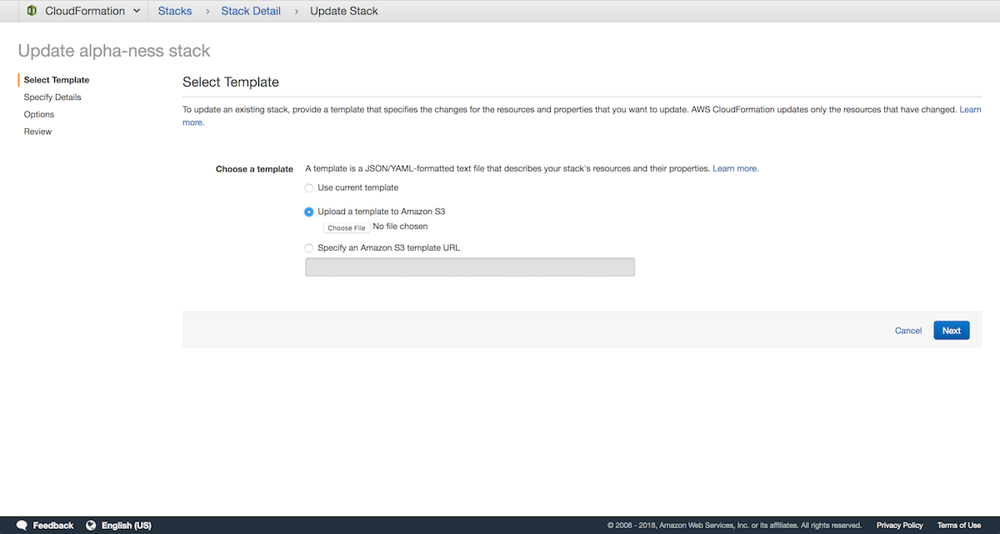
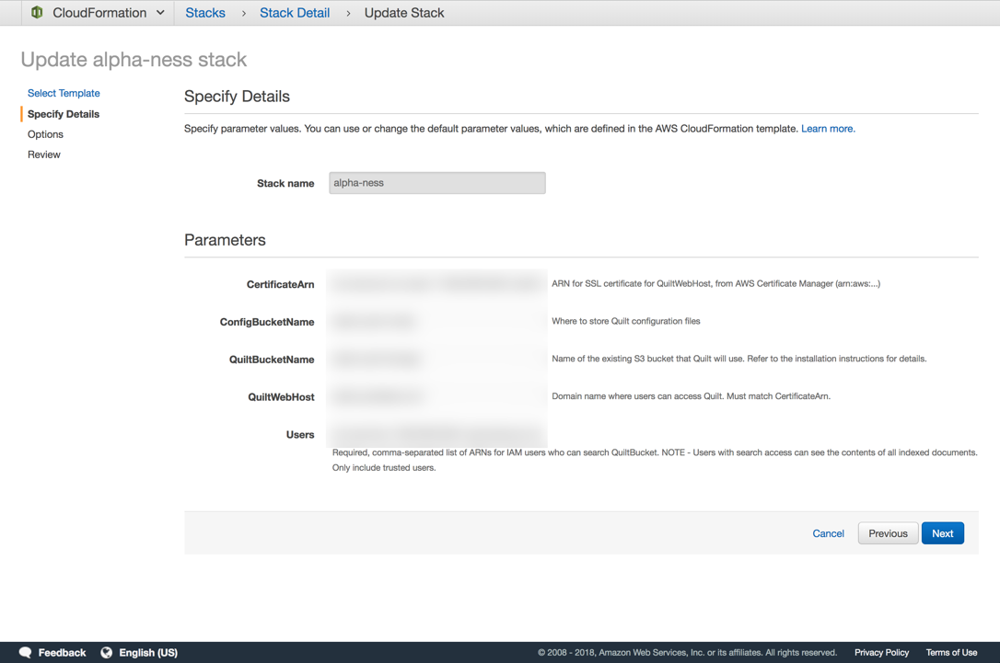
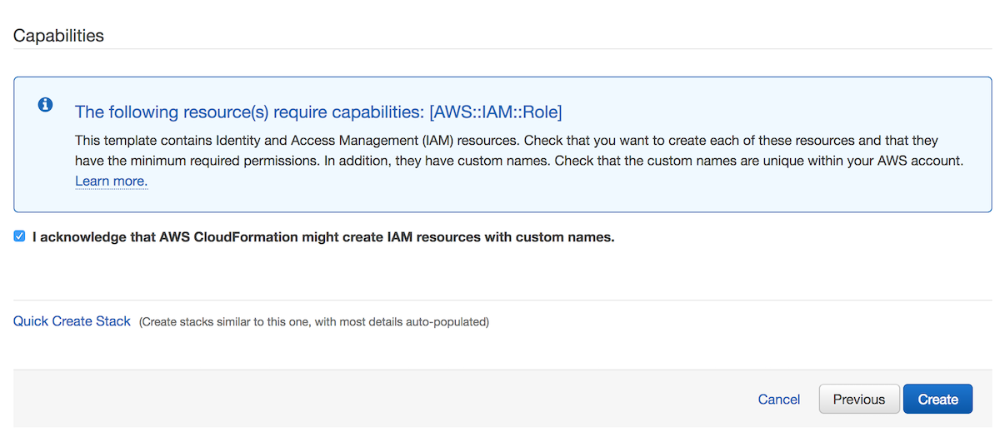
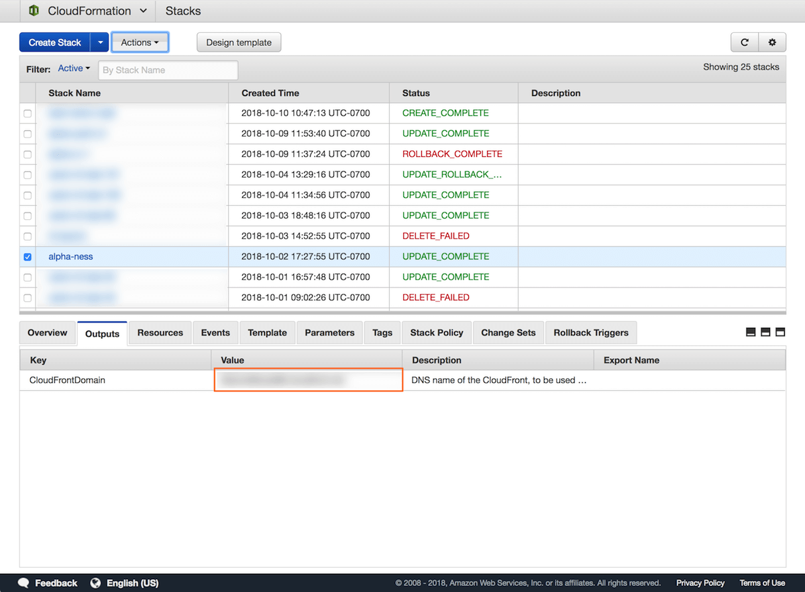

# T4 Alpha Preview

## T4 is like Dropbox for data science, built on S3

* T4 adds search, browsing, content preview, and a Python API to any S3 bucket
* Every file in T4 is versioned and searchable
* T4 is for data scientists, data engineers, and data-driven teams

## Support

* [User and API docs](https://github.com/quiltdata/t4)
* [support@quiltdata.io](mailto:support@quiltdata.io)

## Known limitations

* Supports only one bucket
* Search is only enabled for *new objects* uploaded through T4's Python API
* Any IAM users with `ESFullAccess` or `AdministratorAccess` can invoke ElasticSearch over your bucket

## Pre-requisites

1. *Sufficient permissions* - Creating a CloudFormation stack requires sufficient permissions, such as the
`AdministratorAccess` policy
1. *A properly configured S3 bucket* where you will search, store, and browse data with Quilt. It is **highly recommended** that you back up said S3 bucket before proceeding.
   * [Enable object versioning](https://docs.aws.amazon.com/AmazonS3/latest/user-guide/enable-versioning.html) on the bucket
   * Set a [CORS policy](https://docs.aws.amazon.com/AmazonS3/latest/dev/cors.html#how-do-i-enable-cors), similar to the following, on the bucket:
      ```xml
      <?xml version="1.0" encoding="UTF-8"?>
      <CORSConfiguration xmlns="http://s3.amazonaws.com/doc/2006-03-01/">
          <CORSRule>
              <AllowedOrigin>HTTPS://YOUR_CNAME_DOMAIN.COM</AllowedOrigin>
              <AllowedMethod>GET</AllowedMethod>
              <AllowedMethod>PUT</AllowedMethod>
              <AllowedHeader>*</AllowedHeader>
          </CORSRule>
      </CORSConfiguration>
      ```
      The above policy makes it possible for your users to browse buckets on the web.
1. *ARN for server certificate* - We require HTTPS for access to the Quilt web catalog. You may use the CloudFront domain output by CloudFormation. Alternatively, if you wish to use a custom domain, create or upload an [SSL/TLS server certificate](https://docs.aws.amazon.com/IAM/latest/UserGuide/id_credentials_server-certs.html).
1. *ARNs for search users* - Only select users that you specifcy can search S3. Search users can view contents for any bucket object, so only add users that you trust to this list.

## Permissions
Your users use their IAM credentials to access T4 on the web and in Python.

Your designated Search users will be able *to search and preview file contents
on anything in your T4 bucket*. **Only enable search for users who should be
able to see the entire bucket contents**.

## Installation

The following instructions use CloudFormation to install T4 on a bucket in
your AWS account.

1. Log in to your AWS console

1. Go to Services > CloudFormation > Create stack
    <br/>
    <br/>

    
  
1. Click "Upload a template to Amazon S3" and select `t4.yaml`, provided to
you by Quilt
1. Click Next
1. Fill in Stack name and Parameters.
    <br/>
    <br/>

    

> Carefully note parameter descriptions to avoid stack failure
1. Click Next
1. You can safely skip the Options screen (below) by clicking Next
    <br/>
    <br/>

    

1. Acknowledge that CloudFormation may create IAM roles
    <br/>
    <br/>

    

1. Click Create (typically takes 30 minutes to complete)

1. You should see `CREATE_COMPLETE` as the Status for your CloudFormation stack.
Select the stack and open the Outputs tab. The Value of `CloudFrontDomain`
is your CloudFront origin. Depending on your S3 bucket's [CORS policy](#pre-requisites)
your web catalog is available at the CloudFront and/or the `CNAME` set
by you in the following step.
    <br/>
    <br/>

    

1. If desired, set a `CNAME` record with your DNS service that points to your CloudFrontDomain. The `CNAME` must also be present in your [CORS policy](#pre-requisites). Now users can access the T4 catalog at your custom
`CNAME`.
