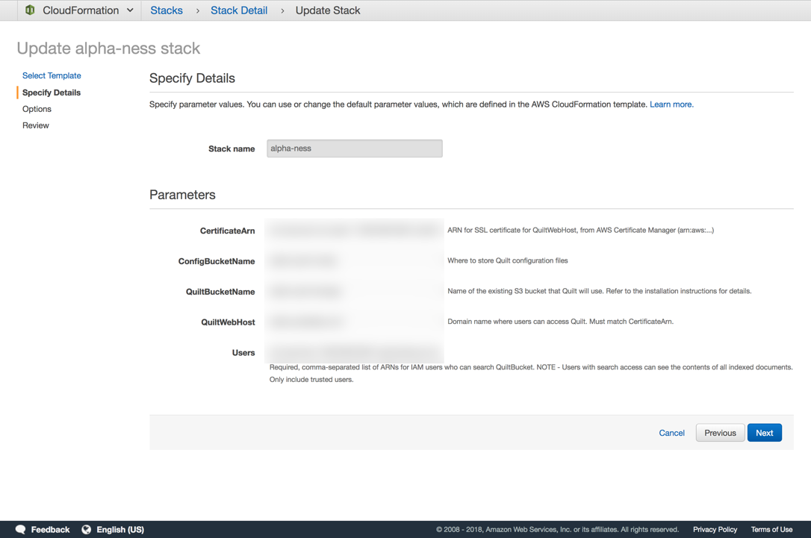

T4 has two different components:
* A Python package, `t4`, distributed via `pip`
* A web interface, the T4 Catalog, deployed using [AWS CloudFormation](https://aws.amazon.com/cloudformation/)

If you have an already-provisioned catalog, only the Python package is needed.


## Installing the T4 client (Python 3.6)


```bash
$ pip install t4
```

If you wish to use AWS resources, such as S3 buckets, you will need valid AWS credentials. If this is your first time using the AWS CLI, run the following:

```bash
$ pip install aws-cli
$ aws configure
```

If you are already using the AWS CLI, you may use your existing profile, or [create a new profile](https://docs.aws.amazon.com/cli/latest/userguide/cli-multiple-profiles.html).

### Developer

Install the current T4 client from `master`:

```bash
$ pip install git+https://github.com/quiltdata/t4.git#subdirectory=api/python
```

## Deploying the catalog
The following instructions use CloudFormation to install T4 on a bucket in your AWS account.

* Log in to your AWS console
* Go to Services > CloudFormation > Create stack


* Click "Upload a template to Amazon S3" and select `t4.yaml`, provided to you by Quilt
* Click Next
* Fill in Stack name and Parameters



> Carefully note parameter descriptions to avoid stack failure

* Click Next
* You can safely skip the Options screen (below) by clicking Next


* Acknowledge that CloudFormation may create IAM roles


* Click Create (typically takes 30 minutes to complete)

* You should see `CREATE_COMPLETE` as the Status for your CloudFormation stack. Select the stack and open the Outputs tab. The Value of `CloudFrontDomain` is your CloudFront origin. Depending on your S3 bucket's [CORS policy](#pre-requisites) your web catalog is available at the CloudFront and/or the `CNAME` set by you in the following step.


* If desired, set a `CNAME` record with your DNS service that points to your CloudFrontDomain. The `CNAME` must also be present in your [CORS policy](#pre-requisites). Now users can access the T4 catalog at your custom
`CNAME`.
