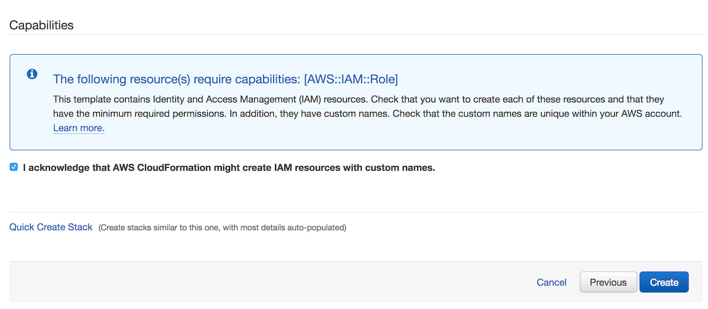

# Installation

T4 has two different components:
* A Python package, `t4`
* A web interface, the T4 Catalog

If you have an already-provisioned catalog, only the Python package is needed.

## T4 client

Python 3.6 is required.

```bash
$ pip install t4
```

If you wish to use AWS resources, such as S3 buckets, you will need valid AWS credentials. If this is your first time using the AWS CLI, run the following:

```bash
$ pip install aws-cli
$ aws configure
```

If you are already using the AWS CLI, you may use your existing profile, or [create a new profile](https://docs.aws.amazon.com/cli/latest/userguide/cli-multiple-profiles.html).

### Developer

Install the current T4 client from `master`:

```bash
$ pip install git+https://github.com/quiltdata/t4.git#subdirectory=api/python
```

## Catalog

The Javascript catalog is a single-page, static application.
You can build it as follows:

```
$ cd catalog
$ npm run build
```

The static assets, including webpack chunks, are written to `/static`.

For more advanced deployment scripts, see [`deploy_navigator.sh`](../deployment/deploy_navigator.sh).


## AWS T4 Instance (via CloudFormation)
The following section uses AWS CloudFormation to deploy and manage the resources
required to run a T4 bucket and catalog in your own VPC.

### Known limitations

* Supports only one bucket
* Search is only enabled for *new objects* uploaded through T4's Python API
* Any IAM users with `ESFullAccess` or `AdministratorAccess` can invoke ElasticSearch over your bucket

### Pre-requisites

1. *Sufficient permissions* - Creating a CloudFormation stack requires sufficient permissions, such as the
`AdministratorAccess` policy
1. *A properly configured S3 bucket* where you will search, store, and browse data with Quilt. It is **highly recommended** that you back up said S3 bucket before proceeding.
   * [Enable object versioning](https://docs.aws.amazon.com/AmazonS3/latest/user-guide/enable-versioning.html) on the bucket
   * Set a [CORS policy](https://docs.aws.amazon.com/AmazonS3/latest/dev/cors.html#how-do-i-enable-cors), similar to the following, on the bucket:
      ```xml
      <?xml version="1.0" encoding="UTF-8"?>
      <CORSConfiguration xmlns="http://s3.amazonaws.com/doc/2006-03-01/">
      <CORSRule>
          <AllowedOrigin>https://yourcompanydomain.com</AllowedOrigin>
          <AllowedMethod>GET</AllowedMethod>
          <AllowedMethod>HEAD</AllowedMethod>
          <AllowedMethod>PUT</AllowedMethod>
          <AllowedMethod>POST</AllowedMethod>
          <AllowedHeader>*</AllowedHeader>
          <MaxAgeSeconds>3000</MaxAgeSeconds>
      </CORSRule>
      </CORSConfiguration>
      ```
      The above policy makes it possible for your users to browse buckets on the web.
      > Note: bucket CORS does not grant permissions of any kind.
      > `AllowedMethod`s are only callable by IAM users or roles with sufficient permissions.
1. *ARN for server certificate* - We require HTTPS for access to the Quilt web catalog. You may use the CloudFront domain output by CloudFormation. Alternatively, if you wish to use a custom domain, create or upload an [SSL/TLS server certificate](https://docs.aws.amazon.com/IAM/latest/UserGuide/id_credentials_server-certs.html).
1. *ARNs for search users* - Only select users that you specifcy can search S3. Search users can view contents for any bucket object, so only add users that you trust to this list.

### Permissions
Your users use their IAM credentials to access T4 on the web and in Python.

Your designated Search users will be able *to search and preview file contents
on anything in your T4 bucket*. **Only enable search for users who should be
able to see the entire bucket contents**.

### CloudFormation

The following instructions use CloudFormation to install T4 on a bucket in
your AWS account.

1. Log in to your AWS console

1. Go to Services > CloudFormation > Create stack
    <br/>
    <br/>

    
  
1. Click "Upload a template to Amazon S3" and select `t4.yaml`, provided to
you by Quilt
1. Click Next
1. Fill in Stack name and Parameters.
    <br/>
    <br/>

    

  - **BucketDescription** - This is a short explanation of your bucket that will be displayed alongside its icon and title in the dropdown menu at the top-left of the navigator.

  - **BucketIcon** - This is a URL that points to a square icon that will display as part of your bucket's entry in the dropdown manu.

  - **BucketTitle** - Human-friendly title for your bucket to be displayed in the dropdown menu.

  - **CertificateArn** - This is the arn for your AWS-managed SSL certificate for your QuiltWebHost domain. Use AWS Certificate Manager to set this up.

  - **ConfigBucketName** - An unused bucket name for the template to create and populate with your navigator's configuration.

  - **QuiltBucketName** - The name of an existing S3 bucket you want to use with T4. It will store your T4 data.

  - **QuiltWebHost** - The URL you want to use to access your navigator on the Internet. You must have a valid SSL certificate for this domain in `CertificateArn` if you want to use https.

  - **Users** - A non-empty comma-separated list of IAM User ARNs that will grant permission to those users to search. A good first entry in this list is your own ARN, which you can find in IAM.

  - Notes - Updating BucketIcon, BucketDescription, or BucketTitle will not update your navigator configuration -- these parameters are only checked when a stack is being created at this time. You'll need to update your federation.json in your config bucket to update these values.


1. Click Next
1. You can safely skip the Options screen (below) by clicking Next
    <br/>
    <br/>

    

1. Acknowledge that CloudFormation may create IAM roles
    <br/>
    <br/>

    

1. Click Create (typically takes 30 minutes to complete)

1. You should see `CREATE_COMPLETE` as the Status for your CloudFormation stack.
Select the stack and open the Outputs tab. The Value of `CloudFrontDomain`
is your CloudFront origin. Depending on your S3 bucket's [CORS policy](#pre-requisites)
your web catalog is available at the CloudFront and/or the `CNAME` set
by you in the following step.
    <br/>
    <br/>

    

1. If desired, set a `CNAME` record with your DNS service that points to your CloudFrontDomain. The `CNAME` must also be present in your [CORS policy](#pre-requisites). Now users can access the T4 catalog at your custom
`CNAME`.
