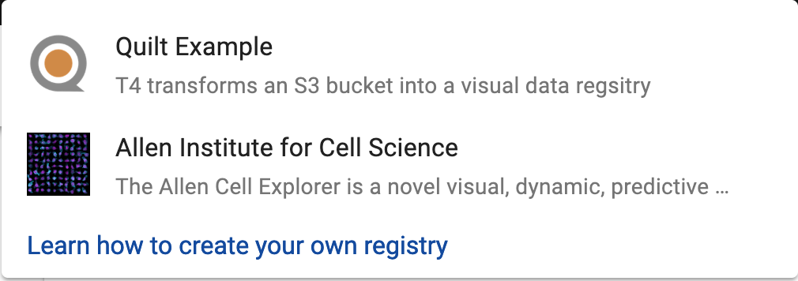

This page provides a technical reference on certain advanced configuration options in T4.

## Deploying Quilt on AWS

The following instructions use CloudFormation to deploy T4 services to your private AWS account.

1. Ensure you have sufficient permissions to proceed. The `AdministratorAccess` policy is sufficient.
2. Create, or ensure you have already created, an [AWS TLS Certificate](https://aws.amazon.com/certificate-manager/) which maps to the public domain name you want your catalog to use. For example, if you want your catalog to be publicly accessible from `t4.foo.com`, you will need to have a certificate for `t4.foo.com` or `*.foo.com` registered in your account.

   An AWS certificate is an Amazon-issued HTTPS certificate, created via the [AWS Certificate Manager service](https://aws.amazon.com/certificate-manager/), and it's a necessity because it enables HTTPS access to your catalog. If you have not created one, [step through the flow for creating one now](https://docs.aws.amazon.com/acm/latest/userguide/gs-acm-request-public.html). If you already have a certificate for your website, but it's not an AWS-issued certificate, see the instructions on [importing an external certificate into AWS](https://docs.aws.amazon.com/acm/latest/userguide/import-certificate.html).

3. Go to `Services > CloudFormation > Create stack` in your AWS Console.

    

4. Click "Upload a template to Amazon S3" and select the `t4-deployment.yaml` file provided to you by Quilt. Click Next.

5. You should now be at the stack parameters screen. This is where you will fill out of all of the configurable details of your Quilt T4 instance. These are, in order:

    * **Stack name**&mdash;CloudFormation will deploy your T4 catalog instance and all of its associated services as a "stack" with this name. This name is currently only used for administering your resources; it will not be seen by end users.
    * **DefaultSender**&mdash;You can invite other users to T4 via emails from this address. This field is in the form `NAME <ADDRESS>`, where `NAME` is to name is the associated with the email (e.g. `Aleksey`) and `ADDRESS` is the email address that the email will actually be sent from. The name must be alphanumeric, and the address must be a valid email address. For example, `Aleksey <admin@quiltdata.com>`.
  
      Note that the email address must be one that your SMTP server, configured in the next section, has access to.

    * **SmtpHost**, **SmtpPassword**, **SmtpUsername**&mdash;Log-in information for an SMTP mail server. This server will be used to send user invite emails from your `DefaultSendeer` address. If do not have one, you may set one up via [Amazon SES](https://aws.amazon.com/ses/).
    * **AdminUsername**, **AdminEmail**, **AdminPassword**&mdash;This is the account login for the initial catalog administrator account. Only admins can configure catalog permissions. The initial admin account can promote other accounts to admin. Note that `AdminPassword` must be at least 8 characters long.
    * **BucketTitle**, **BucketIcon**, **BucketDescription**&mdash;A bucket title and description, and a URL pointing to a (preferably square) image (in any reasonable image format) that will be used as the bucket logo. These fields are exposed to users in the catalog selection dropdown menu:
    

      > These values can be updated after-the-fact, but not using AWS CloudFormation. Instead, see the instructions in the section "Federations and bucket config".

    * **CertificateArn**&mdash;The [ARN](https://docs.aws.amazon.com/general/latest/gr/aws-arns-and-namespaces.html) associated with the HTTP certificate you will use for HTTPS access to the catalog. See step 4 for instructions on getting one.
    * **QuiltWebHost**&mdash;The URL that your catalog will be served out of. Must pattern match the AWS certificate you provide to the `CertificateARN` field. For example, an AWS certificate for `*.foo.com` allows for `t4.foo.com` or `catalog.foo.com` as your `QuiltWebHost`, but not `t4.notfoo.com`.
    * **DBPassword**&mdash;The auth database password. This database will not be publicly accessible, but you may need to accesss it directly in unusual circumstances. This value must be at least 64 characters in length (use `uuidgen | sha256sum`).
    * **SecretKey**&mdash;Used for session authorization. This value must be at least 64 characters in length (use `uuidgen | sha256sum`).
    * **ProductCode**&mdash;This is a Quilt-set fields with autogenerated values that can be safely ignored.
    * **QuiltBucketName**&mdash;Name of the S3 bucket that this catalog instance will be based out of. This should be the same S3 bucket that you configured for access authorization in step 2.
    * **ConfigBucketName**&mdash;Name of a new S3 bucket that will be created automatically by the stack. This bucket will be used to store certain configuration files associated with your catalog instance. The bucket name must be globally unique, e.g. it cannot point to a bucket that already exists (even if that bucket is in your account).

      We recommend a bucket name ending in `-config`, to make it more obvious that this bucket is configuration-only.
    * **CreateDefaultRoles**&mdash;Whether or not to create default roles, which will be used as part of the invite flow for inviting new users to T4. If set to "False", you will need to do additional configuration before you can invite new users to T4. You should probably leave this set to "True".

6. Click Next.
7. On the Options screen that follows, go to the "Termination Protection" section in "Advanced" and click "Enable".

    

    This protects the stack deployment pipeline from accidental deletion. Click Next.

8. On the confirmation screen, check the box asking you to acknowledge that CloudFormation may create IAM roles, then click Create.

    

    Click Create.

9. CloudFormation typically takes around 30 minutes to spin up your stack. Once that is done, you should see `CREATE_COMPLETE` as the Status for your CloudFormation stack.

    

10. Select the stack and open the Outputs tab. These should be three values there. They are `CloudFrontDomain`, `LoadBalancerDNSName`, and `RegistryHost`. These values still need to be mapped to user-facing URLs via DNS.

11. Go to your DNS service (if you are using AWS, this is [Route 53](https://aws.amazon.com/route53/)). Create two `CNAME` records: one mapping your catalog URL (`QuiltWebHost`) to the `CloudFrontDomain`, and one mapping your auth service URL (`RegistryHost`) to the `LoadBalancerDNSName`.

If all went well, your catalog should now be available and accessible.

## Known limitations

Some known limitations of the catalog are:

* Supports only one bucket
* Search is only enabled for *new objects* uploaded through the T4 Python API

## Federations and bucket config

In this section we will discuss how you can configure your catalog instance using _federations_ and _bucket config_.

When you create your T4 stack, you specify a *ConfigBucketName* in your stack parameters. This bucket will be created and populated with two files -- `config.json` and `federation.json`. `config.json` is the main navigator config file, and contains things that are specific to your navigator, like `defaultBucket` and `signInRedirect`. It also includes one or more references to federations, including your `federation.json`. `federation.json` is your default federation. It includes an inline bucket config for your T4 bucket.

A **federation** is just a list of bucket configurations. Your catalog will specify one or more federations from which it sources its bucket configs. Federations are a convenient way to manage collections of buckets that are useful in groups, like all the T4 buckets owned by a specific group or all public T4 buckets pertaining to a certain field. Each bucket configuration in a federation can be either a hyperlink (possibly relative) to a JSON file containing the bucket config, or an object containing the bucket config itself. 

An example:

```json
{
  "buckets": [
    {
      "... inline bucket config ..."
    },
    "link/to/bucket/config.json",
    "..."
  ]
}
```

A **bucket config**, meanwhile, is a JSON object that describes metadata associated with a T4 bucket. It is of the following form:

```json
{
  "name": "name of s3 bucket",
  "title": "friendly title to be displayed in the catalog drop-down",
  "icon": "square icon to be displayed in the catalog drop-down",
  "description": "short description of the bucket to be displayed in the catalog drop-down",
  "searchEndpoint": "url of the search endpoint for your T4 bucket"
}
```

A bucket config can be included inline in a federation, or it can be a standalone JSON file that is linked from a federation.

## Preparing an AWS Role for use with T4

These instructions document how to set up an existing role for use with T4. If the role you want to use doesn't exist yet, create it now.

Go to your T4 stack in CloudFormation. Go to `Outputs`, then find `RegistryRoleARN` and copy its value. It should look something like this: `arn:aws:iam::000000000000:role/stackname-ecsTaskExecutionRole`.

Go to the IAM console and navigate to `Roles`. Select the role you want to use. Go to the `Trust Relationships` tab for the role, and select `Edit Trust Relationship`. The statement might look something like this:

```json
{
  "Version": "2012-10-17",
  "Statement": [
    "... one or more statements"
  ]
}
```

Add an object to the beginning of the Statement array with the following contents:

```json
{
  "Effect": "Allow",
  "Principal": {
    "AWS": "$YOUR_REGISTRY_ROLE_ARN"
  },
  "Action": "sts:AssumeRole"
},
```

Note the comma after the object. Your trust relationship should now look something like this:

```json
{
  "Version": "2012-10-17",
  "Statement": [
    {
      "Effect": "Allow",
      "Principal": {
        "AWS": "$YOUR_REGISTRY_ROLE_ARN"
      },
      "Action": "sts:AssumeRole"
    },
    "... whatever was here before"
  ]
}
```

You can now configure a Quilt Role with this role (using the Catalog's admin panel, or `t4.admin.create_role`).

## Bucket search

### Custom file indexing

This section describes how to configure which files are searchable in the catalog.

By default, Quilt uses the following configuraiton:

```json
{
    "to_index": [
        ".ipynb",
        ".json",
        ".md",
        ".rmd"
    ]
}
```

To customize which file types are indexed, add a `.quilt/config.json` file to your S3 bucket. `.quilt/config.json` is referenced every time a new object lands in the parent bucket. For example, if you wished to index all `.txt` files (in addition the Quilt defaults), you'd upload the following to `.quilt/config.json`:
```json
{
    "to_index": [
        ".ipynb",
        ".json",
        ".md",
        ".rmd",
        ".txt"
    ]
}
```
It is highly recommended that you continue to index all of the default files, so that users can get the most out of search. center/elasticsearch-scale-up/).

### Search limitations
* Queries containing the tilde (~), forward slash (/), back slash, and angle bracket ({, }, (, ), [, ]) must be quoted. For example search for `'~foo'`, not `~foo`.
* The search index will only pick up objects written to S3 _after_ T4 was enabled on that bucket.
* Files over 10 MB in size may cause search to fail.
* Indexing large or numerous files may require you to [scale up your search domain](https://aws.amazon.com/premiumsupport/knowledge-

### Advanced: publicly accessible search endpoint

By default, Quilt bucket search is only available to authorized Quilt users and is scoped to a single S3 bucket. Search users can see extensive metadata on the objectsin your Quilt bucket. Therefore _be cautious when modifying search permissions_.

This section describes how to make your search endpoint available to anyone with valid AWS credentials.

Go to your AWS Console. Under the `Services` dropdown at the top of the screen, choose `Elasticsearch Service`. Select the domain corresponding to your T4 stack.

Note the value of the `Domain ARN` for your search domain.

In the row of buttons at the top of the pane, select `Modify Access Policy`. Add two statements to the Statement array:

```json
{
  "Effect": "Allow",
    "Principal": {
      "AWS": "*"
    },
    "Action": "es:ESHttpGet",
    "Resource": "$YOUR_SEARCH_DOMAIN_ARN/*"
},
{
  "Effect": "Allow",
  "Principal": {
    "AWS": "*"
  },
  "Action": "es:ESHttpPost",
  "Resource": "$YOUR_SEARCH_DOMAIN_ARN/drive/_doc/_search*"
}
```

Select `Submit` and your search domain should now be open to the public.
