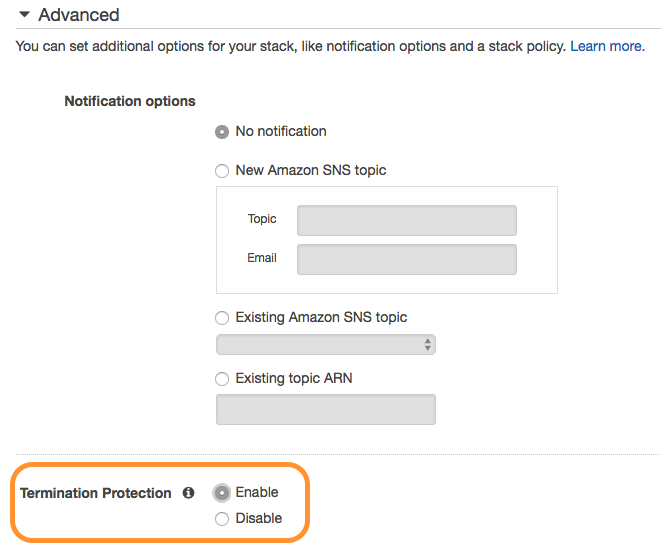

This page provides a technical reference on certain advanced configuration options in T4.

## Deploy a private Quilt instance on AWS

The following instructions use AWS CloudFormation to deploy a private Quilt instance
in your AWS account.

Quilt is a data collaboration platform. A Quilt _instance_ is a private hub that
runs in your virtual private cloud (VPC).
Each instance consists of a password-protected web catalog on your domain,
back end services, a secure server to manage user identities, and a Python API.

### Pre-requisites

1. **An AWS account**

1. **The Quilt CloudFormation Template**. You may obtain and run the template
on [AWS Marketplace](https://aws.amazon.com/marketplace).
Or you may email [contact@quiltdata.io](mailto:contact@quiltdata.io)
to purchase a license.

1. **IAM Permissions** to run the CloudFormation template.
The `AdministratorAccess` policy is sufficient. (Quilt creates and manages a VPC,
containers, S3 buckets, a database, and more.) If you wish to create a service
role for the installation, visit
`IAM > Roles > Create Role > AWS service > CloudFormation` in the AWS console.

1. The **ability to create DNS entries**, such as CNAME and TXT records,
for your company's domain.

1. **An SSL/TLS certificate in the us-east-1 region** to secure the domain where
your users will access your Quilt instance. For example,
to make your Quilt catalog available at `https://quilt.mycompany.com`,
you require a certificate for `*.mycompany.com` in the [AWS Certificate Manager](https://aws.amazon.com/certificate-manager/).
You may either [create a new certificate](https://docs.aws.amazon.com/acm/latest/userguide/gs-acm-request-public.html), or
[import an existing certificate](https://docs.aws.amazon.com/acm/latest/userguide/import-certificate.html).

1. **An SSL/TLS certificate in the same region as your Quilt instance**, for
the elastic load balancer of the Quilt server. See the above pre-requisite for details.

### CloudFormation stack creation

1. If you are using AWS Marketplace, skip this step. Otherwise, go to
`Services > CloudFormation` in the AWS Console. Select the desired region in
the upper right. Click `Create stack`, then upload your template file.
Click `Next`.

    

1. You can now specify stack details in the form of CloudFormation
_parameters_. Refer to the descriptions displayed above each
text box for further details. Once you have completed this page, click `Next`.

    

1. On the Options screen that follows, go to the "Termination Protection" section in "Advanced" and click "Enable".

    

    This protects the stack deployment pipeline from accidental deletion. Click Next.

1. On the confirmation screen, check the box asking you to acknowledge that CloudFormation may create IAM roles, then click Create.

    

    Click Create.

1. CloudFormation typically takes around 30 minutes to spin up your stack. Once that is done, you should see `CREATE_COMPLETE` as the Status for your CloudFormation stack.

    

1. Select the stack and open the Outputs tab. These should be three values there. They are `CloudFrontDomain`, `LoadBalancerDNSName`, and `RegistryHost`. These values still need to be mapped to user-facing URLs via DNS.

1. Go to your DNS service (if you are using AWS, this is [Route 53](https://aws.amazon.com/route53/)). Create two `CNAME` records: one mapping your catalog URL (`QuiltWebHost`) to the `CloudFrontDomain`, and one mapping your auth service URL (`RegistryHost`) to the `LoadBalancerDNSName`.

If all went well, your catalog should now be available and accessible.

## Known limitations

Some known limitations of the catalog are:

* Supports only one bucket
* Search is only enabled for *new objects* uploaded through the T4 Python API

## Federations and bucket config

In this section we will discuss how you can configure your catalog instance using _federations_ and _bucket config_.

When you create your T4 stack, you specify a *ConfigBucketName* in your stack parameters. This bucket will be created and populated with two files -- `config.json` and `federation.json`. `config.json` is the main navigator config file, and contains things that are specific to your navigator, like `defaultBucket` and `signInRedirect`. It also includes one or more references to federations, including your `federation.json`. `federation.json` is your default federation. It includes an inline bucket config for your T4 bucket.

A **federation** is just a list of bucket configurations. Your catalog will specify one or more federations from which it sources its bucket configs. Federations are a convenient way to manage collections of buckets that are useful in groups, like all the T4 buckets owned by a specific group or all public T4 buckets pertaining to a certain field. Each bucket configuration in a federation can be either a hyperlink (possibly relative) to a JSON file containing the bucket config, or an object containing the bucket config itself. 

An example:

```json
{
  "buckets": [
    {
      "... inline bucket config ..."
    },
    "link/to/bucket/config.json",
    "..."
  ]
}
```

A **bucket config**, meanwhile, is a JSON object that describes metadata associated with a T4 bucket. It is of the following form:

```json
{
  "name": "name of s3 bucket",
  "title": "friendly title to be displayed in the catalog drop-down",
  "icon": "square icon to be displayed in the catalog drop-down",
  "description": "short description of the bucket to be displayed in the catalog drop-down",
  "searchEndpoint": "url of the search endpoint for your T4 bucket"
}
```

A bucket config can be included inline in a federation, or it can be a standalone JSON file that is linked from a federation.

## Preparing an AWS Role for use with T4

These instructions document how to set up an existing role for use with T4. If the role you want to use doesn't exist yet, create it now.

Go to your T4 stack in CloudFormation. Go to `Outputs`, then find `RegistryRoleARN` and copy its value. It should look something like this: `arn:aws:iam::000000000000:role/stackname-ecsTaskExecutionRole`.

Go to the IAM console and navigate to `Roles`. Select the role you want to use. Go to the `Trust Relationships` tab for the role, and select `Edit Trust Relationship`. The statement might look something like this:

```json
{
  "Version": "2012-10-17",
  "Statement": [
    "... one or more statements"
  ]
}
```

Add an object to the beginning of the Statement array with the following contents:

```json
{
  "Effect": "Allow",
  "Principal": {
    "AWS": "$YOUR_REGISTRY_ROLE_ARN"
  },
  "Action": "sts:AssumeRole"
},
```

Note the comma after the object. Your trust relationship should now look something like this:

```json
{
  "Version": "2012-10-17",
  "Statement": [
    {
      "Effect": "Allow",
      "Principal": {
        "AWS": "$YOUR_REGISTRY_ROLE_ARN"
      },
      "Action": "sts:AssumeRole"
    },
    "... whatever was here before"
  ]
}
```

You can now configure a Quilt Role with this role (using the Catalog's admin panel, or `t4.admin.create_role`).

## Bucket search

### Custom file indexing

This section describes how to configure which files are searchable in the catalog.

By default, Quilt uses the following configuraiton:

```json
{
    "to_index": [
        ".ipynb",
        ".json",
        ".md",
        ".rmd"
    ]
}
```

To customize which file types are indexed, add a `.quilt/config.json` file to your S3 bucket. `.quilt/config.json` is referenced every time a new object lands in the parent bucket. For example, if you wished to index all `.txt` files (in addition the Quilt defaults), you'd upload the following to `.quilt/config.json`:
```json
{
    "to_index": [
        ".ipynb",
        ".json",
        ".md",
        ".rmd",
        ".txt"
    ]
}
```
It is highly recommended that you continue to index all of the default files, so that users can get the most out of search. center/elasticsearch-scale-up/).

### Search limitations
* Queries containing the tilde (~), forward slash (/), back slash, and angle bracket ({, }, (, ), [, ]) must be quoted. For example search for `'~foo'`, not `~foo`.
* The search index will only pick up objects written to S3 _after_ T4 was enabled on that bucket.
* Files over 10 MB in size may cause search to fail.
* Indexing large or numerous files may require you to [scale up your search domain](https://aws.amazon.com/premiumsupport/knowledge-

### Advanced: publicly accessible search endpoint

By default, Quilt bucket search is only available to authorized Quilt users and is scoped to a single S3 bucket. Search users can see extensive metadata on the objects in your Quilt bucket. Therefore _be cautious when modifying search permissions_.

This section describes how to make your search endpoint available to anyone with valid AWS credentials.

Go to your AWS Console. Under the `Services` dropdown at the top of the screen, choose `Elasticsearch Service`. Select the domain corresponding to your T4 stack.

Note the value of the `Domain ARN` for your search domain.

In the row of buttons at the top of the pane, select `Modify Access Policy`. Add two statements to the Statement array:

```json
{
  "Effect": "Allow",
    "Principal": {
      "AWS": "*"
    },
    "Action": "es:ESHttpGet",
    "Resource": "$YOUR_SEARCH_DOMAIN_ARN/*"
},
{
  "Effect": "Allow",
  "Principal": {
    "AWS": "*"
  },
  "Action": "es:ESHttpPost",
  "Resource": "$YOUR_SEARCH_DOMAIN_ARN/drive/_doc/_search*"
}
```

Select `Submit` and your search domain should now be open to the public.
