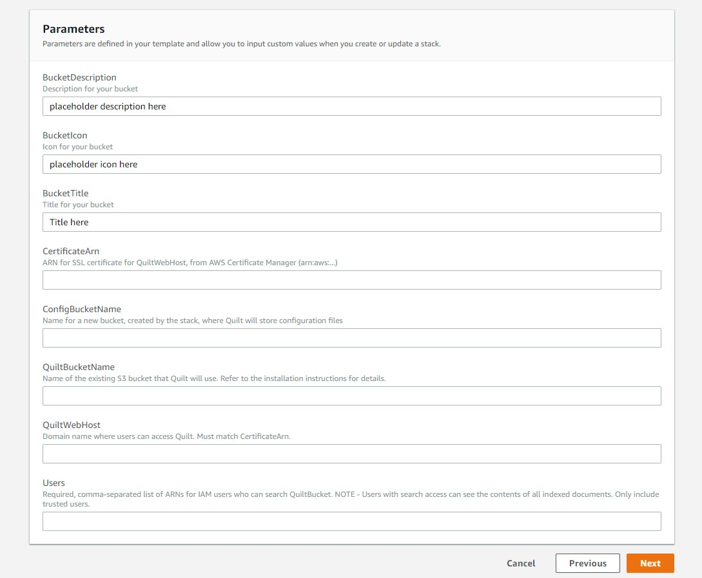

This page provides a technical reference on certain advanced configuration options in T4.

## Deploying the T4 Catalog on AWS

The following section uses AWS CloudFormation to deploy and manage the resources required to run a T4 bucket and catalog in your own VPC.

### Known limitations

* Supports only one bucket
* Search is only enabled for *new objects* uploaded through T4's Python API
* Any IAM users with `ESFullAccess` or `AdministratorAccess` can invoke ElasticSearch over your bucket

### Pre-requisites

1. *Sufficient permissions* - Creating a CloudFormation stack requires sufficient permissions, such as the
`AdministratorAccess` policy
1. *A properly configured S3 bucket* where you will search, store, and browse data with Quilt. It is **highly recommended** that you back up said S3 bucket before proceeding.
   * [Enable object versioning](https://docs.aws.amazon.com/AmazonS3/latest/user-guide/enable-versioning.html) on the bucket
   * Set a [CORS policy](https://docs.aws.amazon.com/AmazonS3/latest/dev/cors.html#how-do-i-enable-cors), similar to the following, on the bucket:

      ```xml
      <?xml version="1.0" encoding="UTF-8"?>
      <CORSConfiguration xmlns="http://s3.amazonaws.com/doc/2006-03-01/">
      <CORSRule>
          <AllowedOrigin>https://yourcompanydomain.com</AllowedOrigin>
          <AllowedMethod>GET</AllowedMethod>
          <AllowedMethod>HEAD</AllowedMethod>
          <AllowedMethod>PUT</AllowedMethod>
          <AllowedMethod>POST</AllowedMethod>
          <AllowedHeader>*</AllowedHeader>
          <MaxAgeSeconds>3000</MaxAgeSeconds>
      </CORSRule>
      </CORSConfiguration>
      ```

      The above policy makes it possible for your users to browse buckets on the web.
      > Note: bucket CORS does not grant permissions of any kind.
      > `AllowedMethod`s are only callable by IAM users or roles with sufficient permissions.
1. *ARN for server certificate* - We require HTTPS for access to the Quilt web catalog. You may use the CloudFront domain output by CloudFormation. Alternatively, if you wish to use a custom domain, create or upload an [SSL/TLS server certificate](https://docs.aws.amazon.com/IAM/latest/UserGuide/id_credentials_server-certs.html).
1. *ARNs for search users* - Only select users that you specifcy can search S3. Search users can view contents for any bucket object, so only add users that you trust to this list.

### Permissions

Your users use their IAM credentials to access T4 on the web and in Python.

Your designated Search users will be able *to search and preview file contents
on anything in your T4 bucket*. **Only enable search for users who should be
able to see the entire bucket contents**.

### CloudFormation

The following instructions use CloudFormation to install T4 on a bucket in
your AWS account.

1. Log in to your AWS console

1. Go to Services > CloudFormation > Create stack


  
1. Click "Upload a template to Amazon S3" and select `t4.yaml`, provided to
you by Quilt
1. Click Next
1. Fill in Stack name and Parameters.



* **BucketDescription** - This is a short explanation of your bucket that will be displayed alongside its icon and title in the dropdown menu at the top-left of the navigator.

* **BucketIcon** - This is a URL that points to a square icon that will display as part of your bucket's entry in the dropdown manu.

* **BucketTitle** - Human-friendly title for your bucket to be displayed in the dropdown menu.

* **CertificateArn** - This is the arn for your AWS-managed SSL certificate for your QuiltWebHost domain. Use AWS Certificate Manager to set this up.

* **ConfigBucketName** - An unused bucket name for the template to create and populate with your navigator's configuration.

* **QuiltBucketName** - The name of an existing S3 bucket you want to use with T4. It will store your T4 data.

* **QuiltWebHost** - The URL you want to use to access your navigator on the Internet. You must have a valid SSL certificate for this domain in `CertificateArn` if you want to use https.

* **Users** - A non-empty comma-separated list of IAM User ARNs that will grant permission to those users to search. A good first entry in this list is your own ARN, which you can find in IAM.

* Notes - Updating BucketIcon, BucketDescription, or BucketTitle will not update your navigator configuration -- these parameters are only checked when a stack is being created at this time. You'll need to update your federation.json in your config bucket to update these values.

1. Click Next
1. On the Options screen, Under the Advanced section, next to Termination Protection, select the Enable check box. This protects the stack deployment pipeline from deletion. Then continue by clicking Next


1. Acknowledge that CloudFormation may create IAM roles


1. Click Create (typically takes 30 minutes to complete)

1. You should see `CREATE_COMPLETE` as the Status for your CloudFormation stack.
Select the stack and open the Outputs tab. The Value of `CloudFrontDomain`
is your CloudFront origin. Depending on your S3 bucket's [CORS policy](#pre-requisites)
your web catalog is available at the CloudFront and/or the `CNAME` set
by you in the following step.


1. If desired, set a `CNAME` record with your DNS service that points to your CloudFrontDomain. The `CNAME` must also be present in your [CORS policy](#pre-requisites). Now users can access the T4 catalog at your custom
`CNAME`.

## Federations and Bucket Config

In this section we will discuss how you can configure your catalog instance using _federations_ and _bucket config_.

When you create your T4 stack, you specify a *ConfigBucketName* in your stack parameters. This bucket will be created and populated with two files -- `config.json` and `federation.json`. `config.json` is the main navigator config file, and contains things that are specific to your navigator, like `defaultBucket` and `signInRedirect`. It also includes one or more references to federations, including your `federation.json`. `federation.json` is your default federation. It includes an inline bucket config for your T4 bucket.

A **federation** is just a list of bucket configurations. Your catalog will specify one or more federations from which it sources its bucket configs. Federations are a convenient way to manage collections of buckets that are useful in groups, like all the T4 buckets owned by a specific group or all public T4 buckets pertaining to a certain field. Each bucket configuration in a federation can be either a hyperlink (possibly relative) to a JSON file containing the bucket config, or an object containing the bucket config itself. 

An example:

```json
{
  "buckets": [
    {
      "... inline bucket config ..."
    },
    "link/to/bucket/config.json",
    "..."
  ]
}
```

A **bucket config**, meanwhile, is a JSON object that describes metadata associated with a T4 bucket. It is of the following form:

```json
{
  "name": "name of s3 bucket",
  "title": "friendly title to be displayed in the catalog drop-down",
  "icon": "square icon to be displayed in the catalog drop-down",
  "description": "short description of the bucket to be displayed in the catalog drop-down",
  "searchEndpoint": "url of the search endpoint for your T4 bucket"
}
```

A bucket config can be included inline in a federation, or it can be a standalone JSON file that is linked from a federation.

## Preparing an AWS Role for use with T4

These instructions document how to set up an existing role for use with T4. If the role you want to use doesn't exist yet, create it now.

Go to your T4 stack in CloudFormation. Go to `Resources`, then find `RegistryUser` and click on the linked user.
Copy the `ARN` of that user. This will look something like this: `arn:aws:iam::730278974607:user/t4-staging-RegistryUser-1CQZVBO2OZO87`.

Go to the IAM console and navigate to `Roles`. Select the role you want to use. Go to the `Trust Relationships` tab for the role, and select `Edit Trust Relationship`. The statement might look something like this:

```json
{
  "Version": "2012-10-17",
  "Statement": [
    "... one or more statements"
  ]
}
```

Add an object to the beginning of the Statement array with the following contents:

```json
{
  "Effect": "Allow",
  "Principal": {
    "AWS": "$YOUR_REGISTRY_USER_ARN"
  },
  "Action": "sts:AssumeRole"
},
```

Note the comma after the object. Your trust relationship should now look something like this:

```json
{
  "Version": "2012-10-17",
  "Statement": [
    {
      "Effect": "Allow",
      "Principal": {
        "AWS": "$YOUR_REGISTRY_USER_ARN"
      },
      "Action": "sts:AssumeRole"
    },
    "... whatever was here before"
  ]
}
```

You can now configure a Quilt Role with this role (using the Catalog's admin panel, or `t4.admin.create_role`).

## Configuring search file types

This section describes how to configure what types of files are indexed and searchable in the catalog.

To modify which file types are searchable, populate a `.quilt/config.json` file in your S3 bucket. Note that this file does not exist by default. The contents of the file shoud be something like this:

```json
{
    "ipynb": true,
    "json": true,
    "md": true
}
```

To change which file types are searchable, push a new JSON fragment like this one to the `.quilt/config.json` path in the bucket.

> There are currently some important limitations with search:
>
> * Queries containing the tilde (~), forward slash (/), back slash, and angle bracket ({, }, (, ), [, ]) must be quoted. For example search for `'~foo'`, not `~foo`.
> * The search index will only pick up objects written to S3 _after_ T4 was enabled on that bucket.
> * Files over 10 MB in size may cause search to fail.

## Making your search endpoint publicly accessible

This section describes how to make your search endpoint available to anyone with valid AWS credentials.

Go to your AWS Console. Under the `Services` dropdown at the top of the screen, choose `Elasticsearch Service`. Select the domain corresponding to your T4 stack.

Note the value of the `Domain ARN` for your search domain.

In the row of buttons at the top of the pane, select `Modify Access Policy`. Add two statements to the Statement array:

```json
{
  "Effect": "Allow",
    "Principal": {
      "AWS": "*"
    },
    "Action": "es:ESHttpGet",
    "Resource": "$YOUR_SEARCH_DOMAIN_ARN/*"
},
{
  "Effect": "Allow",
  "Principal": {
    "AWS": "*"
  },
  "Action": "es:ESHttpPost",
  "Resource": "$YOUR_SEARCH_DOMAIN_ARN/drive/_doc/_search*"
}
```

Select `Submit` and your search domain should now be open to the public.
